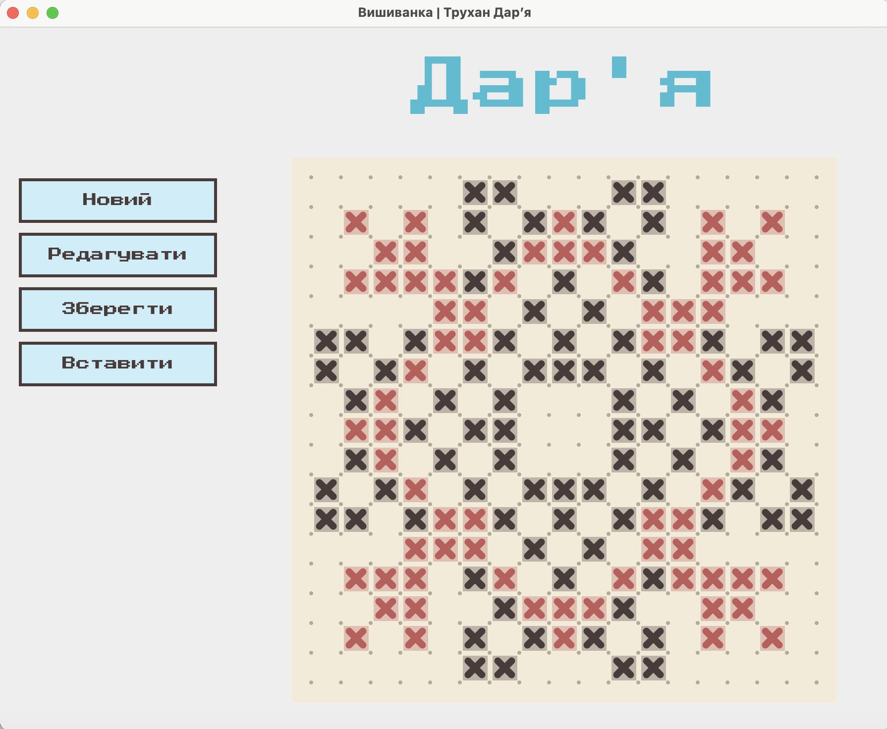
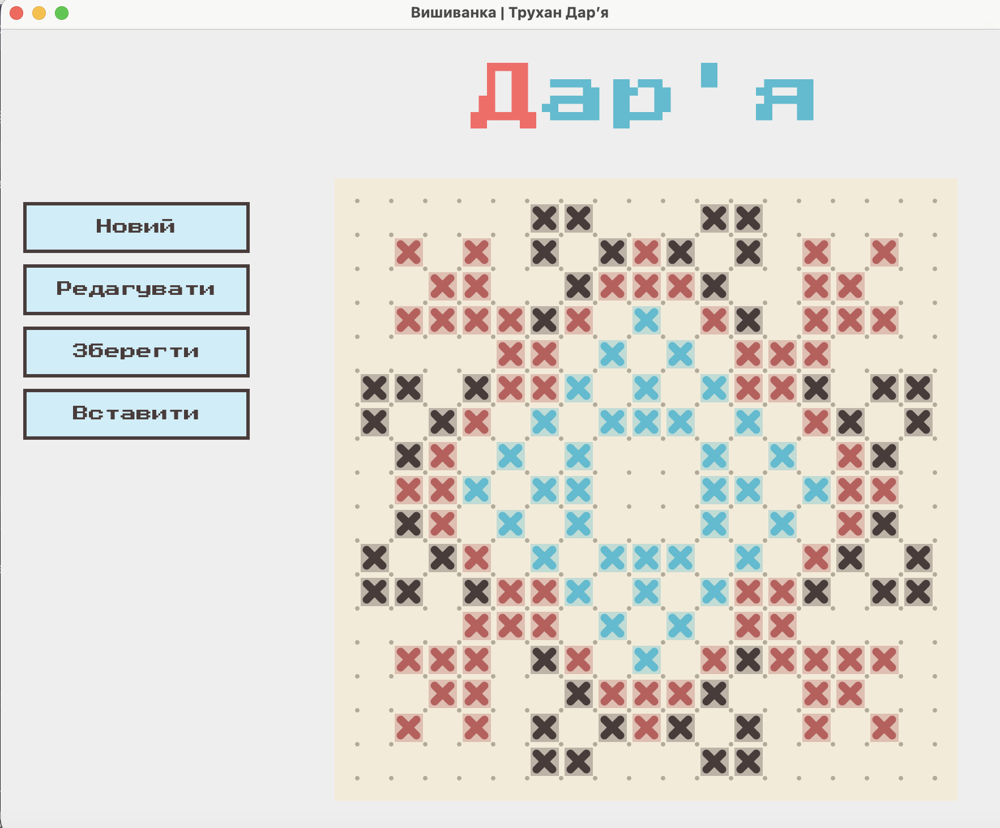
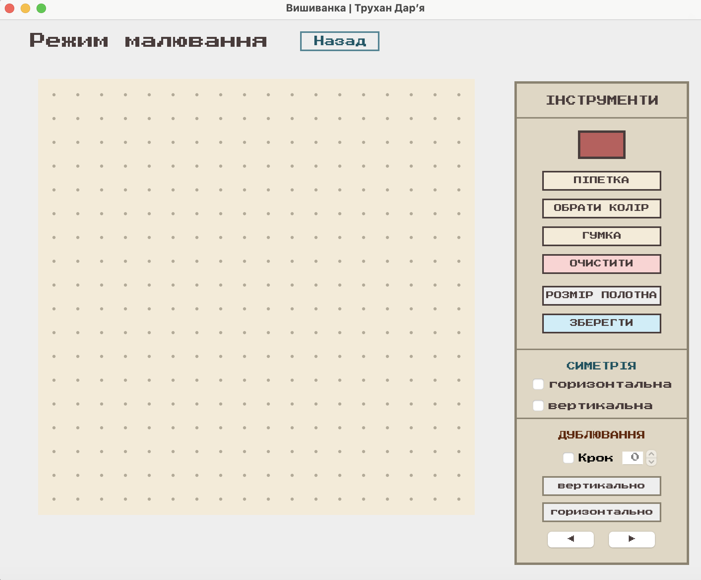
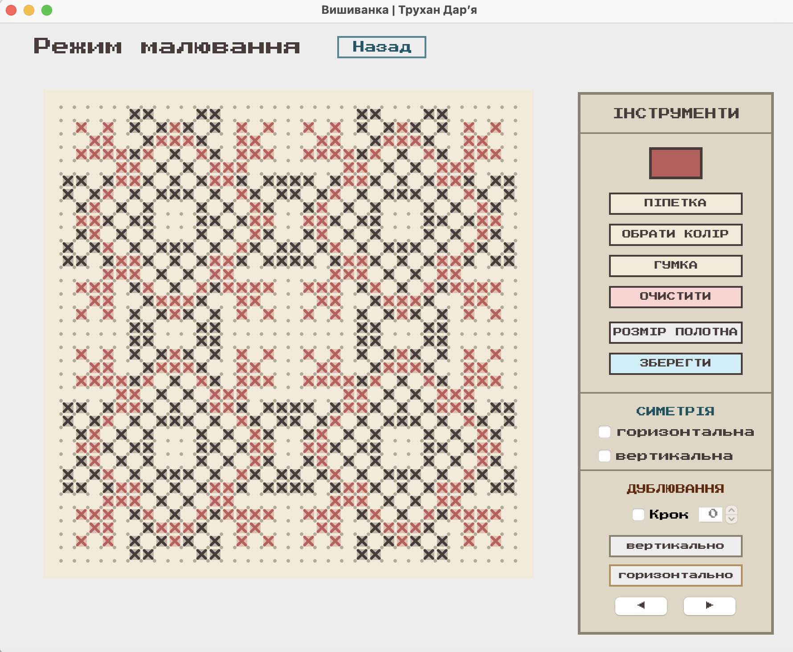

#  "Піксельна вишивка. Редактор орнаменту"

Програма **«Вишиванка»** — це графічний редактор, розроблений мовою Java (Swing). Додаток призначений для цифрового відтворення та збереження схем української вишивки.

---
## Інтерфейс

---
##  Функціонал програми

### 1. Головне вікно та Інтерактивна презентація
* **Автоматична анімація:** При запуску програми відкривається головне вікно та запускається покрокова анімація, яка послідовно, клітинка за клітинкою, «вишиває» орнамент та виводить літери імені «Дар'я».
* **Інтерактивне підсвічування:** При наведенні курсора миші на літери імені, відповідні їм сектори орнаменту динамічно підсвічуються бірюзовим кольором. Це дозволяє візуально зрозуміти, яка літера за яку частину схеми відповідає.

### 2. Головне меню навігації 
Через ліву бічну панель навігації користувач може миттєво перейти до обраної дії:
* **Новий** — відкриває чисте робоче полотно для створення власного візерунка з нуля.
* **Редагувати** — переносить згенерований орнамент імені з головного екрана в редактор для його подальшої модифікації.
* **Зберегти** — дозволяє миттєво експортувати поточне зображення з головного екрана у файл.
* **Вставити** — відкриває діалогове вікно для завантаження раніше збереженого файлу з диска для його перегляду або редагування.

### 3. Робочий простір та Інструменти малювання
У вікні редактора з правого боку розташована розширена панель інструментів:
* **Палітра кольорів:** Інтерактивний вибір кольору нитки для малювання.
* **Гумка:** Інструмент для видалення хрестиків з полотна.
* **Очищення полотна:** Кнопка для повного видалення всіх елементів малюнка за один клік.
* **Зміна розмірів:** Лічильники для динамічного налаштування кількості рядків та стовпців полотна.
* **Автоматична симетрія:** Функція дзеркального малювання по горизонталі, вертикалі або обох осях одночасно.
* **Крок повторення:** Можливість задати інтервал для автоматичного циклічного дублювання візерунка вздовж ряду.
* **Експорт:** Кнопка збереження, яка генерує схему вишивки у форматі **png**.

### 4. Додаткові можливості
* **Масштабування полотна (+/-):** Можливість збільшувати або зменшувати розмір робочого поля для зручного промальовування дрібних деталей візерунка без втрати якості графіки.
* **Піпетка:** Інструмент для швидкого копіювання будь-якого кольору безпосередньо з полотна.
* **Історія дій ("◀" / "▶"):** Повноцінний функціонал `Undo` та `Redo` (скасувати / повернути дію), що дозволяє легко виправляти помилки при малюванні.

---
* **Мова програмування:** Java (JDK 17+)
* **Графічна бібліотека:** Java Swing & AWT (Graphics2D)
* **Тестування:** JUnit 5 (модульні тести для перевірки логіки контролера)
* **Шрифти:**`PressStart2P-Regular.ttf`
---